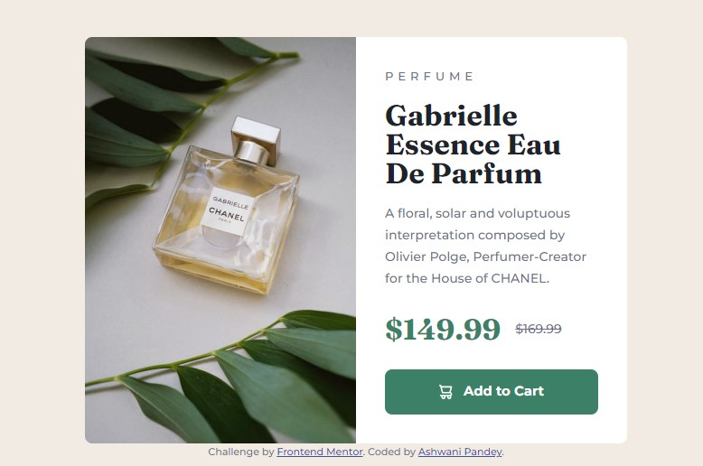
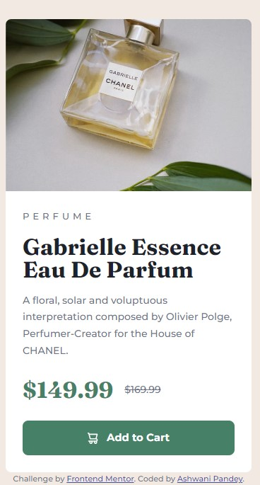

# Frontend Mentor - Product preview card component solution

This is a solution to the [Product preview card component challenge on Frontend Mentor](./design/desktop-design.jpg.jpg). Frontend Mentor challenges help me improve my coding skills by building realistic projects. 

## Table of contents

- [Overview](#overview)
  - [The challenge](#the-challenge)
  - [Screenshot](#screenshot)
  - [Links](#links)
- [My process](#my-process)
  - [Built with](#built-with)
  - [What I learned](#what-i-learned)
- [Author](#author)
- [Acknowledgments](#acknowledgments)

**Note: Delete this note and update the table of contents based on what sections you keep.**

## Overview

The Product Preview Card component is a visually appealing and interactive element that provides a snapshot of a product. It showcases key details such as product image, name, price, and rating in a compact and intuitive manner. It offers a seamless user experience and can be easily integrated into various web and mobile applications.

### The challenge

Users should be able to:

- View the optimal layout depending on their device's screen size
- See hover and focus states for interactive elements
- use too many types of images with different widths and heights in a single element without using too many divs.

### Screenshot





### Links

- Solution URL: [Add solution URL here](https://your-solution-url.com)
- Live Site URL: [Add live site URL here](https://your-live-site-url.com)

## My process

### Built with

- Semantic HTML5 markup
- CSS custom properties
- Flexbox
- CSS Grid
- Mobile-first workflow
- [Custom CSS Reset](hhttps://www.joshwcomeau.com/css/custom-css-reset/) - For styles

**Note: These are just examples. Delete this note and replace the list above with your own choices**

### What I learned

In this project, we learned about semantic tags in HTML and custom CSS resets, as well as creating CSS variables. We also explored interesting CSS features like the data-link, grid, and flex. Additionally, we discussed CSS naming conventions..

To see how you can add code snippets, see below:

```html
      <picture class="product__img">
        <source srcset="images/image-product-desktop.jpg" media="(min-width: 600px)">
        
      </picture>

      <button class="btn" data-icon="shopping-cart">Add to Cart</button>
```
```css
.btn[data-icon="shopping-cart"]::before{
  content: '';
  width: 15px;
  height: 16px;
  background-image: url('../images/icon-cart.svg');
}
```


## Author

- Frontend Mentor - [@ashwanipydev](https://www.frontendmentor.io/profile/ashwanipydev)
- Twitter - [@CodeWithMeaning](https://twitter.com/CodeWithMeaning)


## Acknowledgments

Special thanks to Frontend Mentor (frontendmentor.com) for providing engaging coding challenges, Kevin Powell's YouTube channel for insightful web development tutorials, Hitesh Choudhary's CodeWithHarry for valuable coding guidance, and Love Babbar for sharing programming knowledge. Their contributions have greatly enriched the learning experience.

**Have fun building!** 🚀

